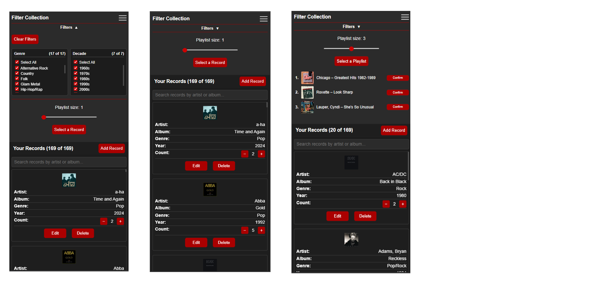
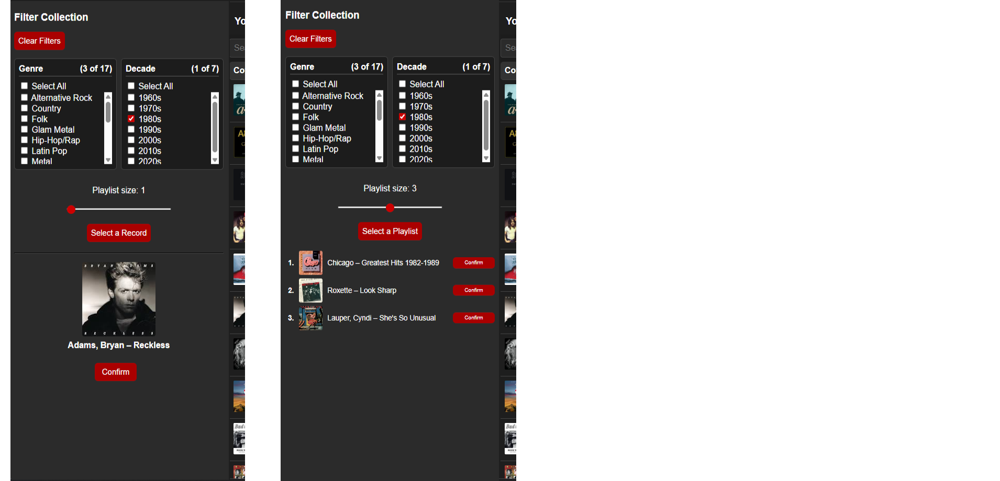
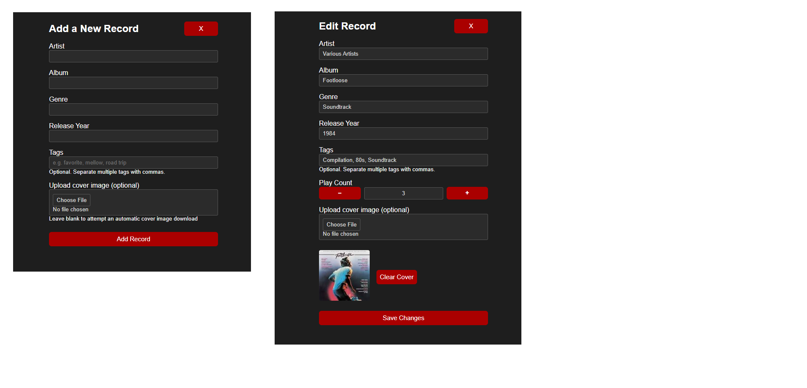

# Vinyl Muse – Record Collection App

Vinyl Muse is a web-based application designed to help users manage, explore, and interact with their personal record collections.

It transforms a static list into an interactive experience through filtering, discovery tools, and lightweight analytics.

---

## Core Problem

Large collections can create decision fatigue, making it difficult to decide what to listen to.

Vinyl Muse addresses this by combining:
- Structured organization (search, filters)
- Discovery tools (random selection, playlists)
- Play tracking and metrics

---

## Application Design / Functionality

Record Management
- Users can add, edit, and delete records with structured fields including artist, album, genre, release year, tags, and cover art
- Duplicate detection prevents redundant entries
- Cover art is automatically fetched when possible, but can also be uploaded
- Play counts are tracked and editable
  
Search & Sorting
- Real-time search filters records by artist, album, genre, and release year
- Column-based sorting supports artist, album, genre, release year, and play count

Dynamic filtering
- Multi-select filters for genre and decade
- Interdependent filtering logic updates displayed record list and directly influences random selection pool
  
Select a single random record or generate a playlist (2-5 records)
- Recently selected or confirmed records are temporarily excluded to improve variety
- Confirmation system increments play counts and tracks listening behavior

Metrics page
- Collection distribution by genre and decade
- Play counts by genre
- Most played records
- Interactive charts allow filtering of other visuals by clicking categories

Image handling
- Automatic cover art retrieval from multiple sources
- Fallback logic progressively simplifies search queries

---

## Application Preview

### Desktop Experience

#### Default View:

#### Filtered (Genres, Decade):

---

### Mobile Experience
#### Filters panel open | filters panel closed | random playlist generated

---

### Random Selection or Playlist
#### Random selection | random playlist

---

### Record Management
#### Add Record screen | Edit Record screen

---

### Metrics
#### Default view

#### "Rock" genre category clicked (Most Played becomes Most Played - Rock)

---

## UX / Design Considerations

Usability
- Designed around minimizing friction in common actions (search, filter, select)
- Immediate visual feedback for user actions
- Persistent UI state (filters, scroll position) to prevent disruption

Filtering Behavior
- Empty selections are treated as "no filter" rather than excluding all results
- Count display updates to reflect filtered results

Layout / Responsiveness
- Desktop: sidebar filters + table layout
- Mobile: collapsible filters section + stacked card-style records

---

## Live Demo

👉 [Try Vinyl Muse](https://jmgray.pythonanywhere.com/register)

---

## Tech Stack

- Python (Flask)
- SQLite + SQLAlchemy
- HTML / CSS / JavaScript
- Chart.js
- Hosted on PythonAnywhere

---

## Next Steps
- Tag-based filtering/categorization
- Expanded metrics (listening trends over time, top artists, listening patterns)
- Saved filter sets
- Enhanced cover image handling (manual override on initial fetch attempt, correction UI)

