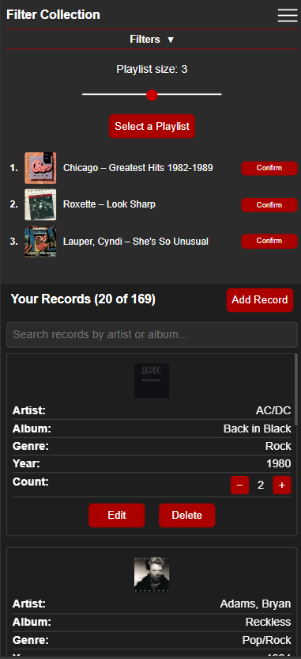

# Vinyl Muse – Record Collection App

Vinyl Muse is a web-based application designed to help users manage, explore, and interact with their personal record collections.

It transforms a static list into an interactive experience through filtering, discovery tools, and lightweight analytics.

---

## Core Problem

Large collections can create decision fatigue, making it difficult to decide what to listen to.

Vinyl Muse addresses this by combining:
- Structured organization (search, filters)
- Discovery tools (random selection, playlists)
- Play tracking and metrics

---

## Key Features

- Multi-dimensional filtering (genre, decade)
- Real-time search and sorting
- Random record selection and playlist generation
- Play tracking with event-based logic
- Responsive design (desktop + mobile)
- Built-in metrics and visualizations

---

## Application Preview

### Desktop vs Mobile

---

### Filtering & Search

---

### Randomizer & Playlist

---

### Record Management

---

### Metrics

---

## Live Demo

👉 [Try Vinyl Muse](https://your-pythonanywhere-url)

---

## Tech Stack

- Python (Flask)
- SQLite + SQLAlchemy
- HTML / CSS / JavaScript
- Chart.js
- Hosted on PythonAnywhere

---

## Full Project Breakdown

👉 [View Full Project Details](project_details.md)
