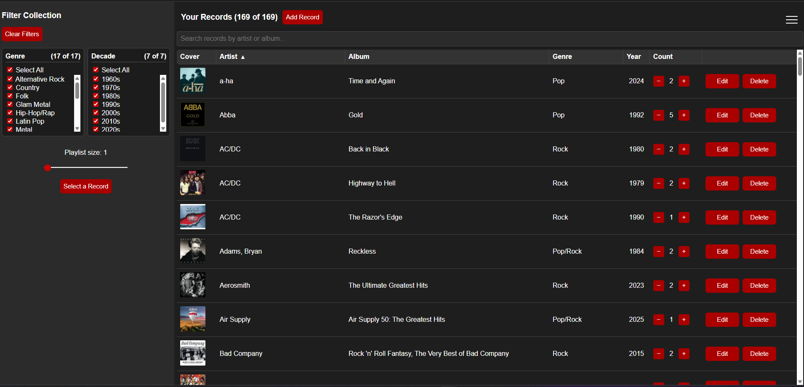
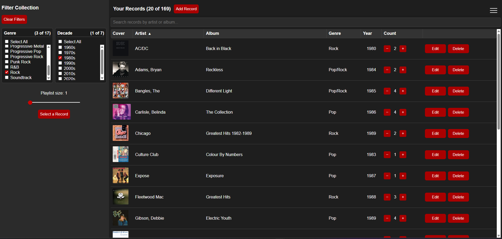
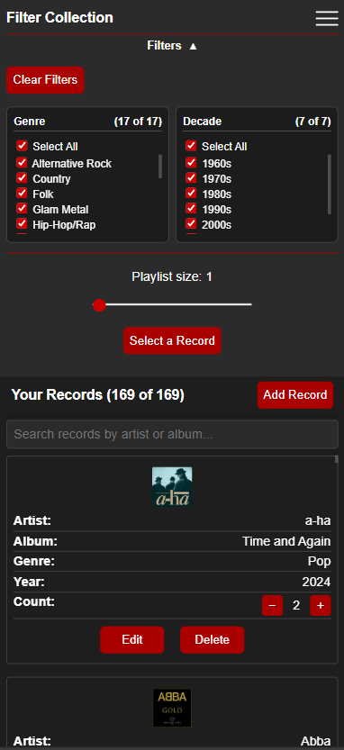
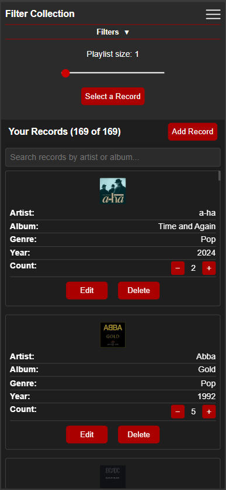
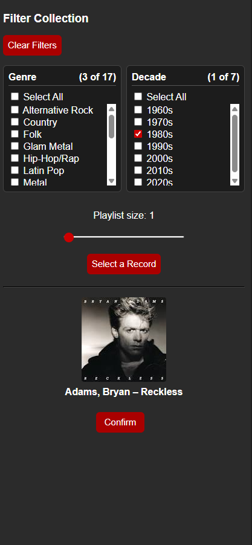
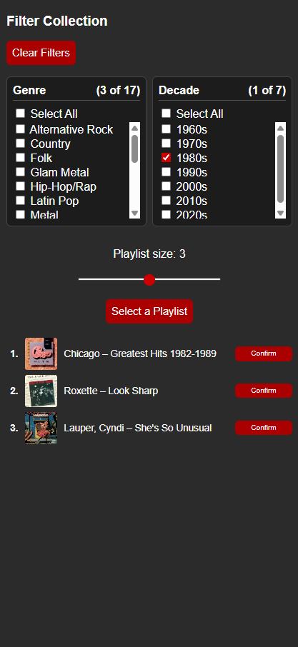
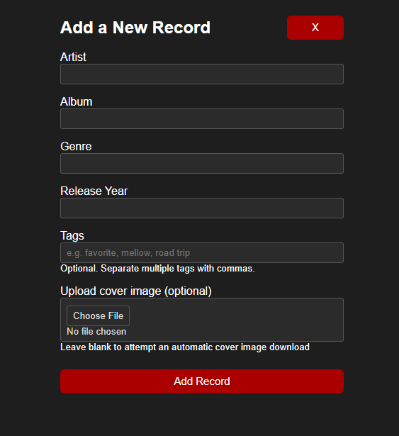
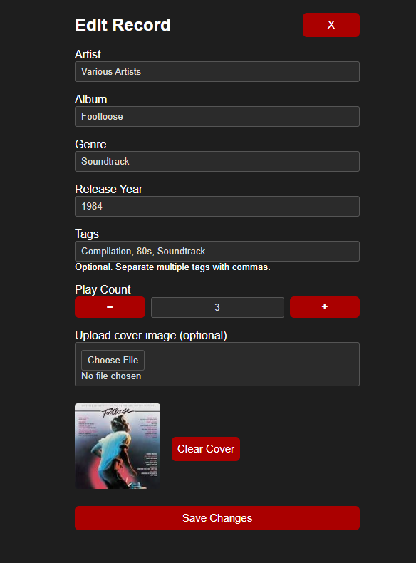
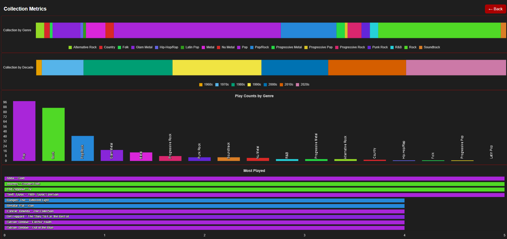
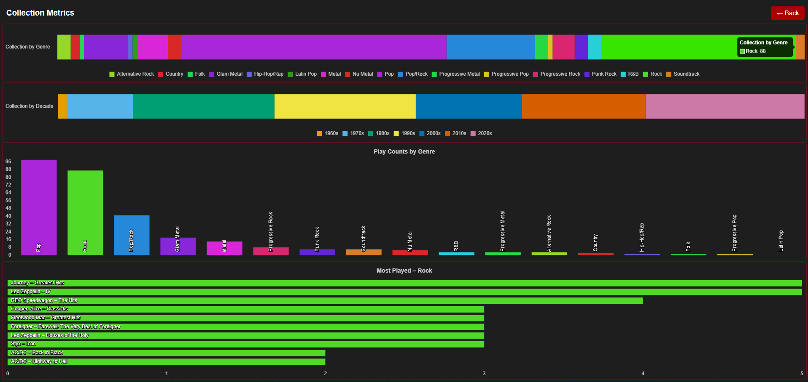

# Vinyl Muse – Record Collection App

Vinyl Muse is a web-based application designed to help users manage, explore, and interact with their personal record collections.

It transforms a static list into an interactive experience through filtering, discovery tools, and lightweight analytics.

---

## Core Problem

Large collections can create decision fatigue, making it difficult to decide what to listen to.

Vinyl Muse addresses this by combining:
- Structured organization (search, filters)
- Discovery tools (random selection, playlists)
- Play tracking and metrics

---

## Key Features

- Multi-dimensional filtering (genre, decade)
- Real-time search and sorting
- Random record selection and playlist generation
- Play tracking with event-based logic
- Responsive design (desktop + mobile)
- Built-in metrics and visualizations

---

## Application Preview

### Desktop Experience

#### Default View:

#### Filtered (Genres, Decade):

---

### Mobile Experience
#### Filters Panel open

#### Filters Panel closed

---

### Random Selection or Playlist
#### Random selection

##### Random Playlist 

---

### Record Management
#### Add Record screen

#### Edit Record screen

---

### Metrics
#### Default view

#### "Rock" genre category clicked

---

## Live Demo

👉 [Try Vinyl Muse](https://jmgray.pythonanywhere.com/register)

---

## Tech Stack

- Python (Flask)
- SQLite + SQLAlchemy
- HTML / CSS / JavaScript
- Chart.js
- Hosted on PythonAnywhere

---

## Full Project Breakdown

👉 [View Full Project Details](project_details.md)
